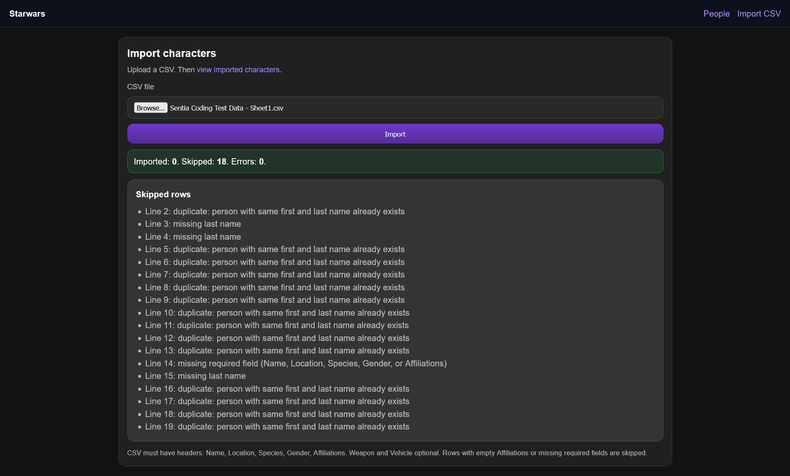
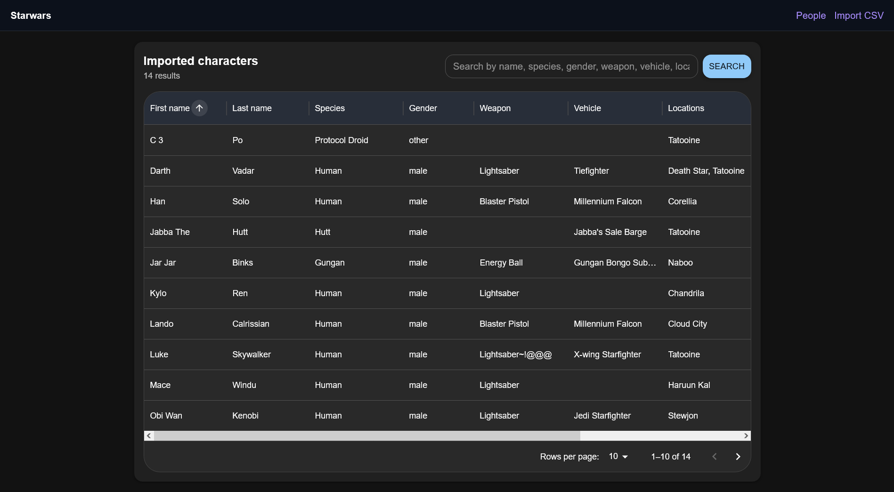

# Star Wars Character Importer

Ruby on Rails API backend with a React frontend for importing Star Wars characters from CSV and browsing them with search, sorting, and server-side pagination.

## Stack

- Backend: Ruby on Rails `8.1.x` API (`sqlite3`, `puma`)
- Frontend: React `19` + Vite + TypeScript
- UI: Material UI (`@mui/material`, `@mui/x-data-grid`)
- API contract: JSON endpoints under `/api`

## Screenshots

### Import page



### People page



## Backend (Ruby on Rails)

- Endpoint: `POST /api/imports` uploads CSV and returns:
  - `imported` count
  - `skipped` rows with line number + reason
  - `errors` for invalid records
- Endpoint: `GET /api/people` supports search, sort, and pagination
- API is JSON-only via `namespace :api, defaults: { format: :json }`

## Frontend (React + MUI)

- `ImportPage` sends multipart upload to `POST /api/imports`
- `PeoplePage` renders MUI `DataGrid` with:
  - `paginationMode="server"`
  - `sortingMode="server"`
  - URL-driven query params (`q`, `sort`, `direction`, `page`, `per_page`)

## Schema used

Database tables and relationships:

- `people`: `first_name`, `last_name`, `species`, `gender`, `weapon`, `vehicle`
  - unique index on `(first_name, last_name)`
  - check constraint for gender: `male | female | other`
- `locations`: unique `name`
- `affiliations`: unique `name`
- Join tables:
  - `person_locations` (`person_id`, `location_id`) unique pair
  - `person_affiliations` (`person_id`, `affiliation_id`) unique pair

Model-level validations:

- `Person`: required `first_name`, `species`, `gender`
- `Person`: at least one `location` and one `affiliation`
- `Location` and `Affiliation`: required unique `name`

## CSV import validation

CSV parser/service rules (`CsvImportService`):

- Required headers: `Name, Location, Species, Gender, Affiliations`
- Accepts comma-separated or tab-separated input
- `Weapon` and `Vehicle` are optional
- Required per-row fields: `Name`, `Location`, `Species`, `Gender`, `Affiliations`
- Name must include a last name (single-part names are skipped)
- Duplicate person check: skips if `(first_name, last_name)` already exists
- Gender normalization:
  - `m` / `male` -> `male`
  - `f` / `female` -> `female`
  - anything else -> `other`
- Creates/reuses `Location` and `Affiliation` records from comma-separated lists

## Server-side pagination

Implemented in `Api::PeopleController#index`:

- Query params:
  - `page` (1-based, defaults to `1`)
  - `per_page` (defaults to `100`, capped at `100`)
  - `sort` (allowed: `first_name`, `last_name`, `species`, `gender`, `weapon`, `vehicle`)
  - `direction` (`asc` or `desc`)
  - `q` free-text search across people, locations, and affiliations
- Response includes:
  - `people`
  - `total_count`
  - `page`
  - `per_page`
  - `total_pages`

## Quick start

Backend (`starwars`):

```bash
bundle install
bin/rails db:setup
bin/rails server
```

Frontend (`starwars-frontend`):

```bash
npm install
npm run dev
```
